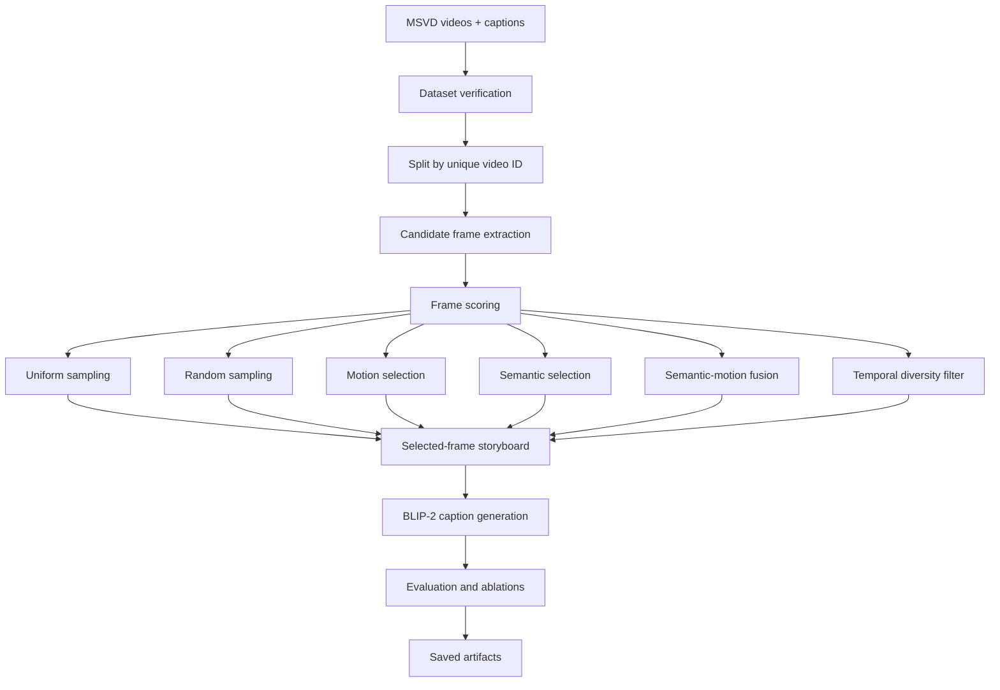

# Adaptive Video Captioning with Semantic-Motion Keyframe Selection

Reduces the cost of video captioning on MSVD by selecting informative keyframes before running BLIP-2, instead of processing every frame.

This repository centers on a Colab-ready research notebook:

- [`notebooks/video_captioning_research.ipynb`](./notebooks/video_captioning_research.ipynb)

It implements video-level splits, candidate frame extraction, motion and semantic scoring, adaptive semantic-motion fusion, temporal diversity filtering, BLIP-2 inference, T4-conscious fine-tuning, evaluation, ablations, and artifact saving.

[](./notebooks/video_captioning_research.ipynb)
[](#quickstart)
[](#data)
[](#training)

---

## Table of Contents

- [Problem & Approach](#problem--approach)
- [Architecture](#architecture)
- [Results](#results)
- [Quickstart](#quickstart)
- [Project Structure](#project-structure)
- [Data](#data)
- [Training](#training)
- [Evaluation](#evaluation)
- [Inference / Serving](#inference--serving)
- [Deployment](#deployment)
- [Configuration](#configuration)
- [Testing](#testing)
- [Monitoring & Drift](#monitoring--drift)
- [Known Limitations](#known-limitations)
- [Roadmap](#roadmap)
- [Contributing](#contributing)
- [Citation](#citation)
- [License](#license)

---

## Problem & Approach

Video captioning models often become expensive when they process long clips frame by frame, especially on constrained hardware like a single NVIDIA T4 GPU. The project addresses this by selecting a small set of representative keyframes from each video and captioning those frames with a pretrained vision-language model.

The core approach combines motion cues, semantic novelty, and temporal diversity so the selected frames cover what changes in the video without wasting compute on near-duplicates. The notebook compares uniform sampling, random sampling, motion-only selection, semantic-only selection, fused selection, and diversity filtering.

Non-goals:

- It does not attempt end-to-end dense video understanding.
- It does not require multi-GPU training.
- It does not depend on A100/H100-class hardware.
- It does not hardcode a single MSVD directory layout.

## Architecture



| Component | Purpose |
|---|---|
| Notebook | Main research workflow and experiment runner |
| OpenCV | Video metadata, frame extraction, motion features |
| BLIP-2 | Vision-language caption generation |
| LoRA / mixed precision | T4-friendly fine-tuning |
| Pandas / NumPy | Split logic, scoring tables, result tables |
| Matplotlib / Seaborn | EDA and result visualizations |

## Results

The notebook is structured to produce comparable results across baselines and the proposed method, but the final metric values depend on the dataset path and on whether you run the optional training/evaluation cells.

Use the generated tables in `results/metrics/` and the consolidated outputs in `results/metrics.csv` and `results/final_results.csv` as the source of truth after execution.

| Metric | Baseline | This Model | Delta | Notes |
|---|---:|---:|---:|---|
| BLEU-1 | run notebook | run notebook | run notebook | reported per split/method |
| BLEU-4 | run notebook | run notebook | run notebook | optional CIDEr if available |
| METEOR | run notebook | run notebook | run notebook | caption similarity metric |
| ROUGE-L | run notebook | run notebook | run notebook | sequence overlap metric |
| CIDEr | run notebook | run notebook | run notebook | computed when dependency exists |

## Quickstart

For a local environment, install the package from the repository root:

```bash
python -m venv .venv
source .venv/bin/activate
pip install -e ".[dev,analysis]"
```

On Google Colab, clone the repository, change into it, and run the notebook's environment cell. Colab already provides PyTorch; install only any packages that the notebook reports as missing.

1. Open [`notebooks/video_captioning_research.ipynb`](./notebooks/video_captioning_research.ipynb) in Google Colab.
2. Set the dataset paths in Section 0.
3. If needed, mount Google Drive in the optional drive cell.
4. Run the environment, dataset verification, splitting, and preprocessing cells.
5. Keep the heavier fine-tuning and ablation flags disabled until you are ready to run them.

Minimal run sequence in the notebook:

```text
0. Research Configuration
1. Environment and GPU Setup
2. Dataset Loading and Verification
3. Exploratory Data Analysis
4. Dataset Splitting
5. Video Preprocessing
6. Candidate Frame Extraction
...
25. Conclusions and Research Interpretation
```

## Project Structure

```text
.
├── README.md
├── configs/                 # Reproducible baseline and training settings
├── notebooks/               # Colab-first research workflow
│   └── video_captioning_research.ipynb
├── research/                # Methodology, experiment log, original task/template
├── results/                 # Empty tracked artifact locations; outputs are ignored
├── scripts/                 # CLI entry points and notebook generator
├── src/video_captioning/    # Reusable data, keyframe, model, training, and metric code
├── tests/                   # Deterministic unit tests
├── pyproject.toml
└── requirements.txt
```

The notebook writes outputs into its configured `OUTPUT_DIR`. The reusable scripts write to the `output_dir` specified in YAML, typically under:

```text
results/
checkpoints/
configs/
cache/
```

## Data

The workflow is built around MSVD.

- Split strategy: unique video ID, not caption-row randomization
- Supported caption schemas: flexible CSV, TSV, and JSON parsing
- Dataset checks: video count, caption count, missing file count, sample records
- Configured locations: `DATA_ROOT`, `VIDEO_DIR`, `CAPTION_FILE`

Example MSVD layout:

```text
msvd/
├── YouTubeClips/
│   ├── video1.avi
│   ├── video2.avi
│   └── ...
└── captions.csv
```

Example caption records:

| video_id | caption |
|---|---|
| `video1` | `a man is playing guitar on stage` |
| `video1` | `the musician performs for the crowd` |
| `video2` | `a dog runs across the grass` |

The notebook saves:

- `train_video_ids.csv`
- `val_video_ids.csv`
- `test_video_ids.csv`
- complete split metadata in `configs/split_metadata.json`

## Training

The notebook includes T4-conscious fine-tuning paths.

- mixed precision where available
- small batch sizes
- gradient accumulation
- optional LoRA
- optional 4-bit loading when supported
- explicit GPU memory cleanup

The training sections are designed to be opt-in through configuration flags so that you can run a fast smoke test first and only enable longer experiments when needed.

The equivalent command-line entry point uses the same implemented methodology:

```bash
python scripts/train.py --config configs/training.yaml
```

It downloads the configured BLIP-2 and DINOv2 checkpoints and requires a valid local MSVD path, so it is intentionally not a lightweight smoke test.

## Evaluation

The notebook supports automatic caption evaluation with:

- BLEU-1 to BLEU-4
- METEOR
- ROUGE-L
- CIDEr when the dependency is available

It also produces:

- ablation tables
- frame-budget studies
- efficiency comparisons
- qualitative examples
- final summary tables

To score a generated-caption CSV with `video_id` and `caption` columns:

```bash
python scripts/evaluate.py --predictions outputs/generated_captions.csv \
  --config configs/baseline.yaml
```

## Inference / Serving

This repository is not a serving project. The notebook is optimized for offline research inference and experiment comparison rather than a deployed API.

For inference inside the notebook, the workflow:

1. selects frames
2. composes them for BLIP-2
3. generates captions
4. writes outputs to the artifact directories

The same local-video workflow is available as a CLI (and downloads model weights on first use):

```bash
python scripts/select_keyframes.py --video path/to/video.avi
python scripts/inference.py --video path/to/video.avi
```

## Deployment

There is no production deployment target in this repository.

The intended runtime is:

- Google Colab
- optionally Kaggle
- optionally a local Python environment with GPU support

## Configuration

Baseline and training settings are stored in [`configs/`](./configs). The notebook retains an equivalent Section 0 configuration block for a self-contained Colab workflow.

Key values:

- `DATA_ROOT`
- `VIDEO_DIR`
- `CAPTION_FILE`
- `OUTPUT_DIR`
- `SEED`
- `NUM_CANDIDATE_FRAMES`
- `NUM_SELECTED_FRAMES`
- `ALPHA`
- `RUN_FINETUNING`
- `RUN_TEST_ABLATIONS`
- `RUN_FRAME_BUDGET_STUDY`

The notebook also prints:

- GPU name
- GPU memory
- CUDA availability
- PyTorch version

## Testing

The repository includes lightweight unit tests for caption normalization, video-level splitting, keyframe selection, evaluation-pair handling, and storyboard composition:

```bash
pytest
```

The notebook additionally performs practical checks:

- dataset existence and schema checks
- GPU capability inspection
- unique-video split verification
- video readability and metadata extraction
- artifact-path creation
- syntax-safe notebook generation from `build_notebook.py`

## Monitoring & Drift

This is a research notebook, not an always-on service, so runtime monitoring is limited to saved logs and artifact outputs.

Useful outputs include:

- frame-selection score CSVs
- generated caption tables
- evaluation summaries
- efficiency tables
- qualitative result images

If you extend this into a deployed system later, the most relevant drift signals would be changes in caption length, token distribution, video duration distribution, and the quality of selected keyframes.

## Known Limitations

- The notebook expects the user to point it at a valid MSVD layout.
- Full fine-tuning can be slow on a T4 and is intentionally disabled by default.
- CIDEr depends on optional evaluation packages.
- The repository does not include the MSVD dataset itself.
- There is no separate inference API or deployment service.

## Roadmap

- add a dedicated data dictionary for the MSVD schema variants
- add a small end-to-end smoke test notebook
- record a representative benchmark run with real metrics
- add a license if you intend to publish the repository publicly

## Contributing

If you extend the notebook, keep the following constraints intact:

- split by unique video ID
- preserve the Colab/T4 memory budget
- keep configuration centralized
- save outputs in deterministic artifact locations
- avoid hardcoding a single local path

## Citation

If you use the notebook or adapt the workflow, cite the underlying paper:

Chunhui Zhang, Yiren Jian, Zhongyu Ouyang, and Soroush Vosoughi. 2025. *Pretrained Image-Text Models are Secretly Video Captioners*. arXiv:2502.13363.

## License

No license file is currently included. Choose and add a license before publishing or sharing the project externally.
